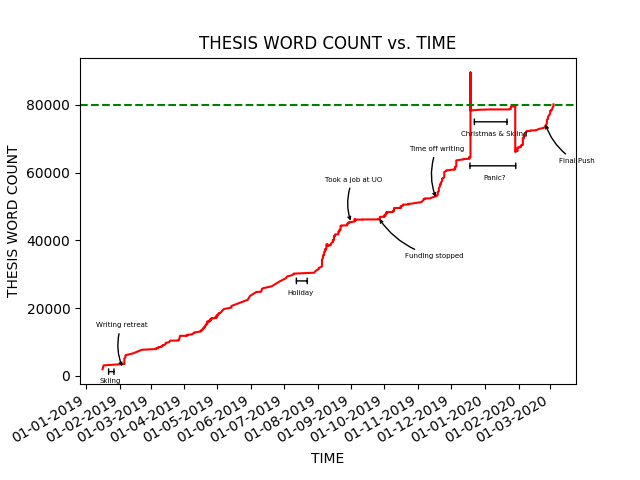

<p align="center">

</p>

# LaTeX Word Count

Script to count words over time in Tex files hosted on Git. Originally inspired by http://phdcomics.com/comics/archive_print.php?comicid=1915 and from  _Git Count Words_ LateX script by Bastian Rieck, originally available at https://gist.github.com/Submanifold/d7b996492dc3020f2acea87b49cc54c3.

### Requirements
- [pandas](https://pandas.pydata.org/pandas-docs/stable/install.html)
- [matplotlib](https://matplotlib.org/)

#### to install requirements

``` bash
$ pip install -r requirements.txt
```
### to use it

``` bash
$ ./word_count.sh
```

### to set writing goals

To set daily writing goals modify ```$daily_goal``` parameter in ```word_count.sh``` script and use today to run the script.

```bash
 ./word_count.sh today
```

### to make graph

```bash
 ./word_count.sh | ./makegraph.py
```

## TODOs/Ideas

- add ignore meta files
- milestones for graph
- automatic GIT hooks for making graph
